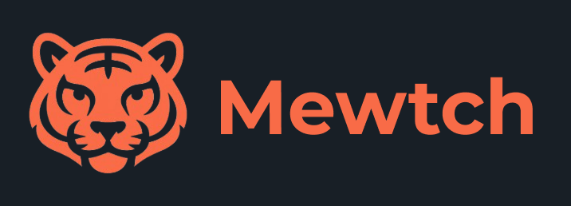

# 🚀 Mewtch - There's always a match.

[](https://github.com/seuusuario/seurepositorio)
[](LICENSE)
[](https://github.com/seuusuario/seurepositorio/releases)
[](https://github.com/seuusuario/seurepositorio/graphs/contributors)
[](https://github.com/seuusuario/seurepositorio/issues)
[](https://github.com/gryphzzjr/Mewtch-Backend/stargazers)

---

## 🌟 Sobre

Bem-vindo ao **Mewtch!**  Aqui você tem as melhores variações de animais de estimação disponíveis para adoção, com certeza o **Match** que você precisa pra ser mais alegre!:

> Um projeto que combina amor, carinho, e a sua vontade de salvar uma vida, tá esperando o que?  :D

---

## 🛠 Tecnologias

- 
- 
- 
- 
- 
- 

---

## ⚡ Funcionalidades

- 🚀 Ultra rápido e otimizado
- 🎨 Interface moderna e responsiva
- 🛡 Segurança de ponta a ponta
- 🤝 Suporte a contribuições e extensões
- 📦 Fácil de instalar e configurar
- 🐾 Algo que só você e seu pet vão entender.

---

## 💻 Instalação

- Primeiro, acesse o nosso site: [https://mewtch.io/](https://mewtch.io/) e navegue até a página de downloads!
- Depois, clique no botão de download.
- Ao entrar no app, crie uma conta!
- Prontinho, escolha o melhor **match** que mais combina com você!

---

# 👐 Contribuição

1. Faça um fork do projeto
2. Crie sua branch ```git checkout  -b feature/nova-feature```
3. Faça commit das suas alterações: ```git commit -m "Adiciona nova feature"```
4. Envie para o repositório remoto: ```git push origin feature/nova-feature```
5. Abra um pull request 🚀

---

# 📄 Licença
Esse projeto está sob a licença **MIT**. Veja [LICENSE](./LICENSE) para mais detalhes.

---

# 🌐 Contato

- Twitter: @gryphzz.ofc
- Linkedin: @gryphzz.jr
- Github: @gryphzzjr

---

### Made with ❤ and 🐾 by Gryphzz